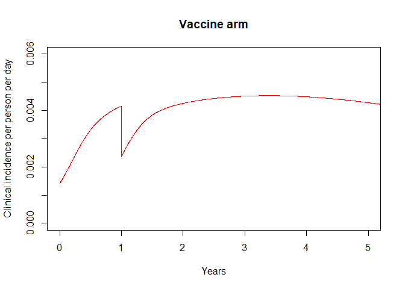
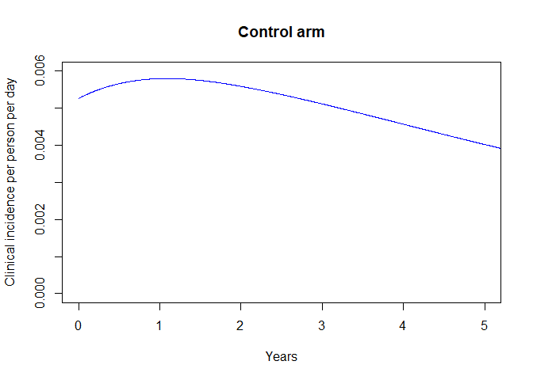
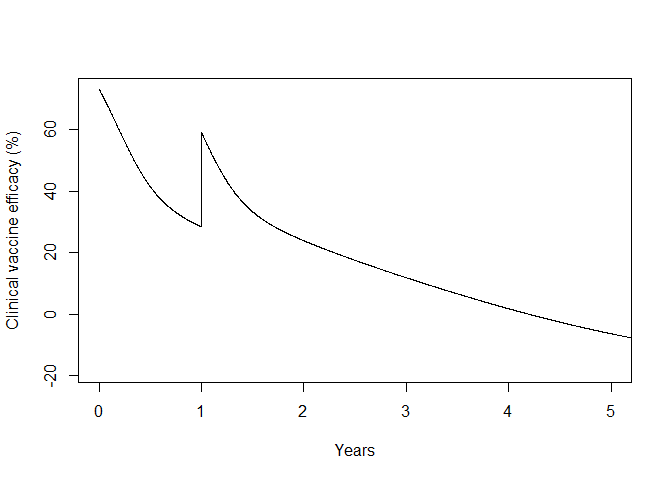

<!-- README.md is generated from README.Rmd. Please edit that file -->

# malariavaxTrials

<!-- badges: start -->
<!-- badges: end -->

malariavaxTrials can be used to simulate clinical malaria indicence in
cohorts in a malaria vaccine trial based on the methods in [White et al
(2015)](https://www.thelancet.com/journals/laninf/article/PIIS1473-3099(15)00239-X/fulltext)
and [Schmit et al
(2024)](https://www.thelancet.com/journals/laninf/article/PIIS1473-3099(23)00816-2/fulltext).
The output can be used to calculate clinical vaccine efficacy. Trial
site and participants characteristics can be accounted for in the
simulation e.g. transmission intensity, seasonality, age and bed net
use.

malariavaxTrials can be used together with the
[boostr](https://github.com/mrc-ide/boostr) package.

## Installation

You can install the development version of malariavaxTrials from
[GitHub](https://github.com/) with:

``` r
# install.packages("pak")
pak::pak("mrc-ide/malariavaxTrials")
```

## Example

This is a basic example which shows you how to simulate clinical
incidence in the different arms of a vaccine trial:

``` r
library(malariavaxTrials)
library(boostr)

# Simulate antibody titres over time using the boostr package

ab <- ab(timesteps = 10*365, # 10 year period
         dose_timesteps = c(1,365), # peak in antibody titres on day 1 (completion of primary vaccination schedule)
                                    # and 1 year later (booster dose)
         init_titres = c(589, 264), # peak antibody titres
         prop_short = c(0.88, 0.7), # proportion of the antibody response that is short-lived
         dur_short = c(45,45),      # duration of short-lived antibody response
         dur_long = c(591, 591))    # duration of long-lived antibody response

# Simulate the corresponding vaccine efficacy against infection over time using the boostr package

vx <- efficacy(titre = ab, max_efficacy = 0.93, alpha = 0.74, beta = 99.2)

# Simulate clinical incidence in trial arms

trial <- simulate_trial_hazards(eir = 20/365,               # daily entomological inoculation rate
                                age = 1:(10*365),           # cohort simulation period (age/time since birth)
                                age_at_enrollment = 365,    # enrollment into trial at age 1 year 
                                gamma_llin = 0.8,           # adjustment for bed net users
                                vx = list(vx),              # simulating a single vaccine arm with efficacy vx
                                n = 10,                     # heterogeneity groups for mosquito biting exposure
                                r_clin = 1.1,               # adjustment for case definition
                                cpp = TRUE)

# Calculate clinical incidence in vaccine and control group adjusting for bed net use

cov_vax <- 0.85       # Bed net use in vaccine arm
cov_control <- 0.89    # Bed net use in control arm

vax_inc <- trial$vax_itn_arm1 * cov_vax + trial$vax_no_itn_arm1 * (1-cov_vax)
control_inc <- trial$control_itn * cov_control + trial$control_no_itn * (1-cov_control)

# Calculate vaccine efficacy against clinical malaria

eff <- 1-vax_inc/control_inc
```

The simulated clinical incidence in each vaccine arm, and the
corresponding clinical vaccine efficacy, look as follows:


